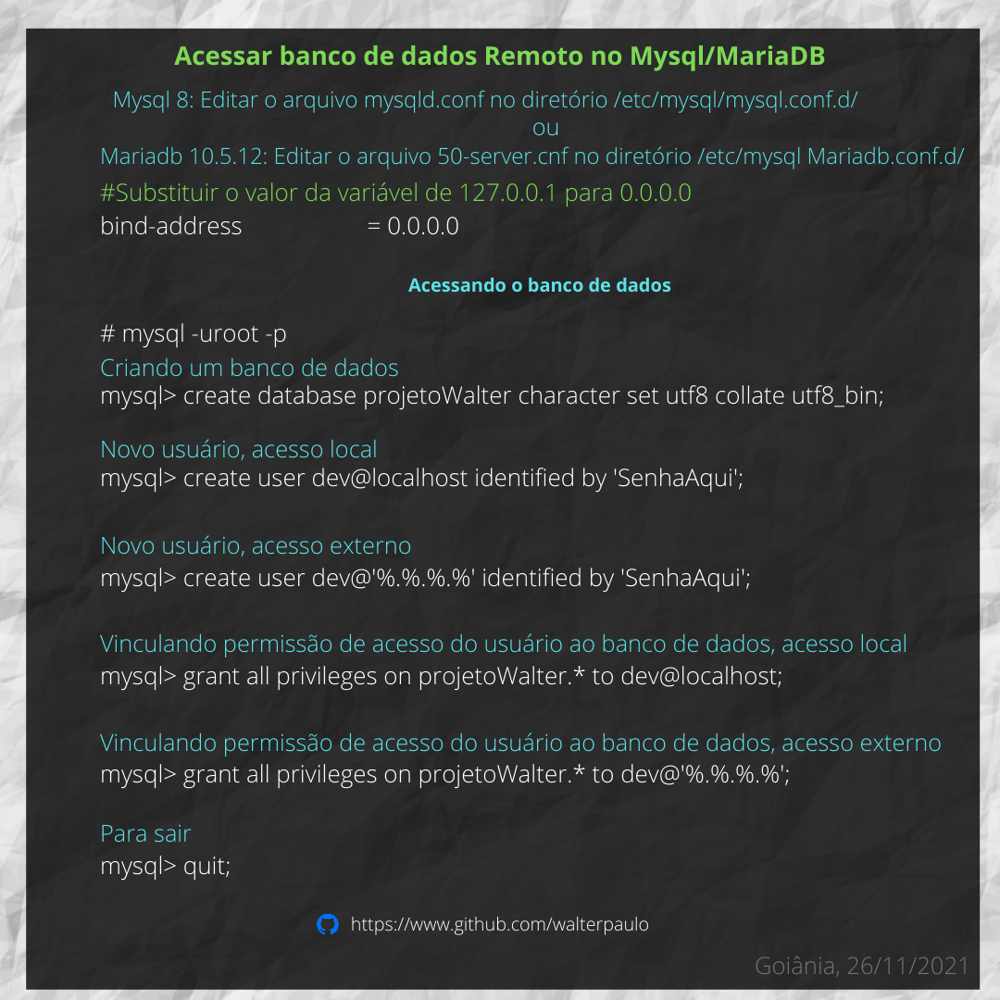

# Bancos de Dados


### Acessar banco de dados Remoto no Mysql/MariaDB
----


<p align="center">
  
</p>

## CÓDIGO:

Acessar o banco
````
# mysql -uroot -p
````

Criando um banco de dados, substituir banco projetoWalter:
````
create database projetoWalter character set utf8 collate utf8_bin;
````

Novo usuário, acesso local:
````
create user dev@localhost identified by 'SenhaAqui';
````
Novo usuário, acesso externo:
````
create user dev@'%.%.%.%' identified by 'SenhaAqui';
````

Vinculando permissão de acesso do usuário ao banco de dados, acesso local:
````
grant all privileges on projetoWalter.* to dev@localhost;
````

Vinculando permissão de acesso do usuário ao banco de dados, acesso externo:
````
grant all privileges on projetoWalter.* to dev@'%.%.%.%';
````

Para sair:
````
quit;
````


